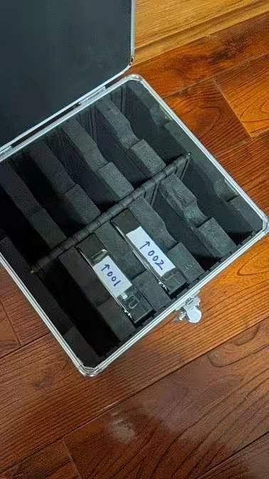
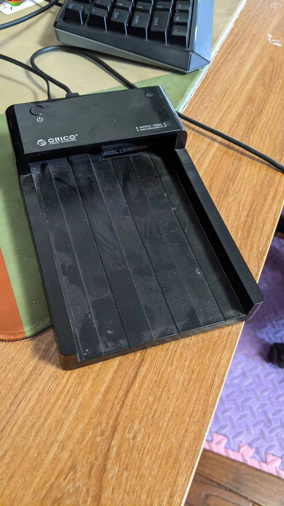
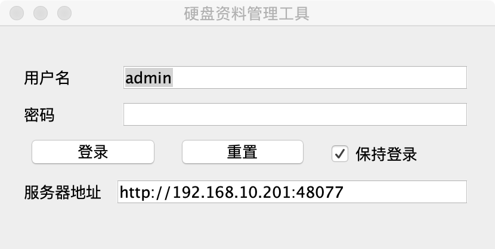
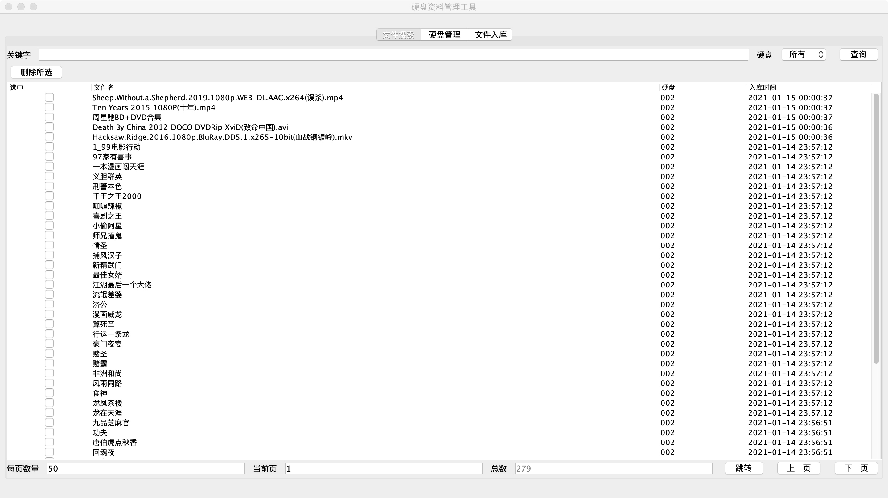
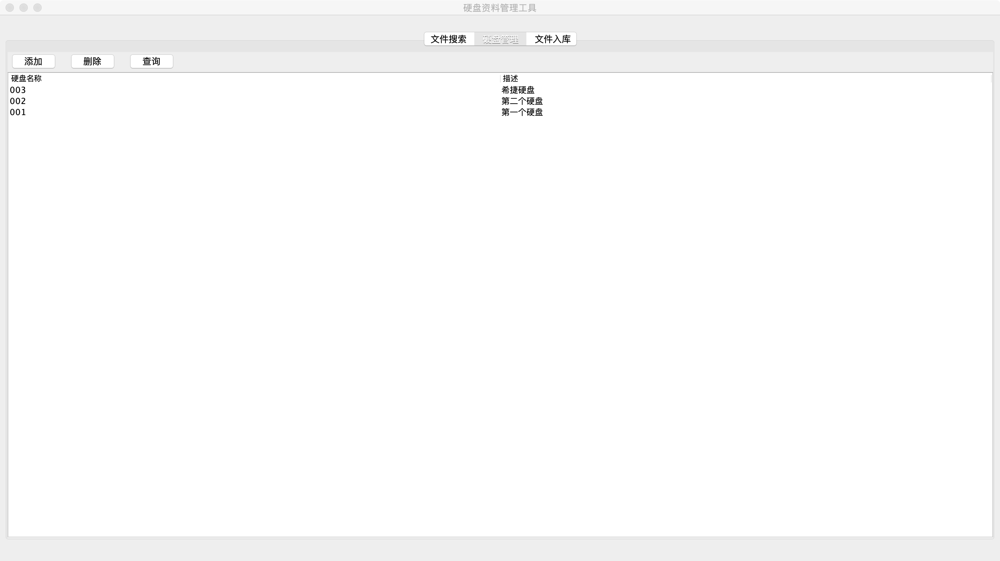
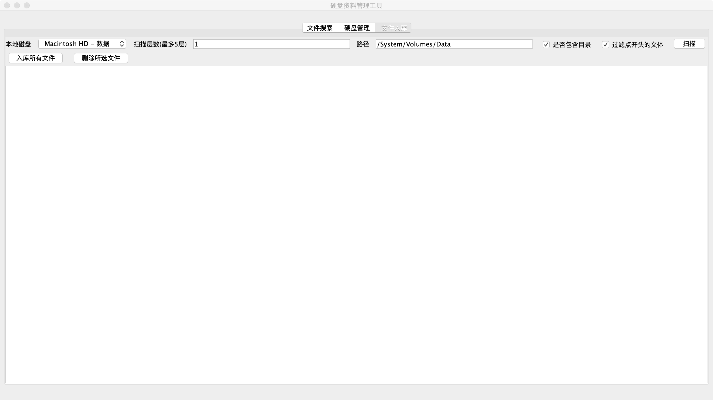

# 硬盘管理前端

## 背景
本人喜欢下载电影，然后在5.1声道的家庭影院里观赏。

但是平时看电影的时间不多，要加班、带娃，偶尔欣赏一部大片。

也想过买个一个8盘位的nas，来下载、保存电影，但是考虑到nas的成本、电费等原因，有点浪费。

我希望的一个方式是，下载好电影后，保存到一块离线硬盘上，并给这个硬盘编好码，把然后把硬盘里的文件名录入到一个系统里。

需要看一部电影的时候，通过这个系统搜索一下，就可以知道电影放在哪块硬盘里。

于是就有这个这个系统。

## 介绍
这是硬盘文件管理的客户端，通过rest协议和[服务端](https://github.com/worldmaomao/hd-manager-server)通讯。

启动入口：com.github.worldmaomao.App

## 截图

### 登录

### 文件搜索

### 硬盘管理

### 文件扫描入库

